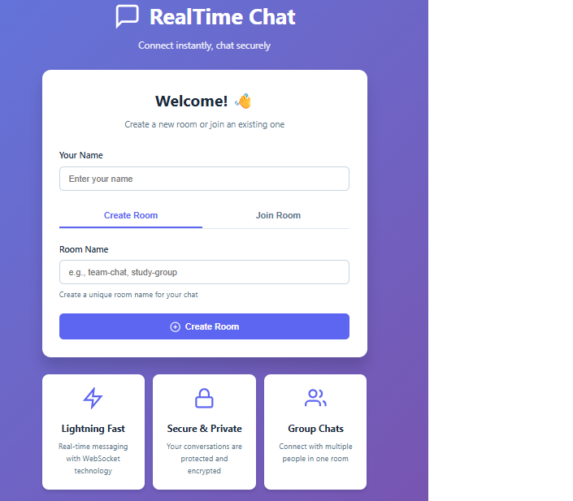
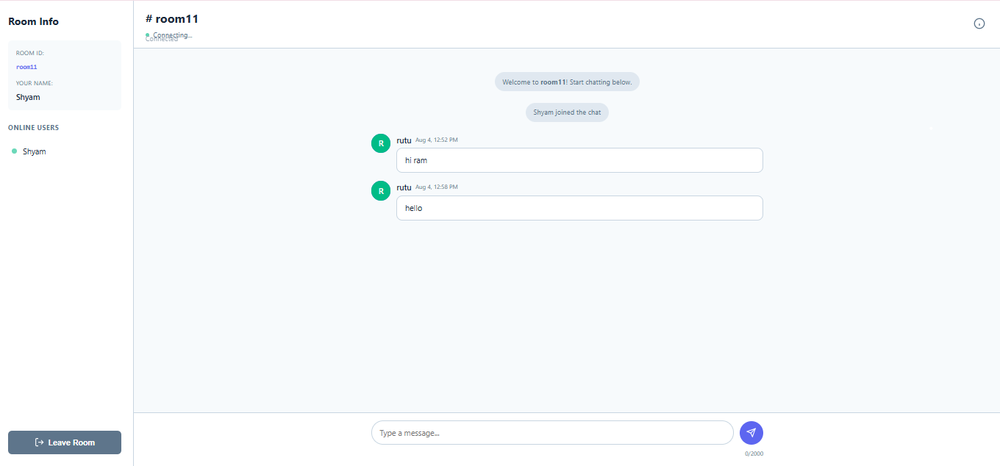

# 💬 Real-Time Chat Application

A full-stack **real-time chat application** built during my internship, designed to enable **instant communication** between users using **WebSocket technology**.  
The system allows users to create accounts, join chat rooms, and exchange messages in real-time with a responsive and modern interface.

---





## 🚀 Key Features

**Real-Time Messaging**  
Instant text communication using Spring WebSocket (STOMP over SockJS).

**User Authentication**  
Secure login and registration system for managing users.

**Chat Rooms**  
Users can join existing rooms or create new ones dynamically.

**Private Chats**  
Start one-on-one conversations with other users.

**Typing Indicators**  
Real-time feedback when another user is typing.

**Chat History**  
Persist messages in MongoDB for retrieval on re-login.

**User Presence**  
Display active/online users in each chat room.

**Notifications**  
Get alerts when new messages arrive or users join/leave rooms.

**Multimedia Support (Optional)**  
Extendable to support image and file sharing in chat.

---

## 🧩 Technology Stack

| Layer | Technology |
|-------|-------------|
| **Backend** | Spring Boot, Spring WebSocket, STOMP |
| **Frontend** | HTML5, CSS3, JavaScript (Thymeleaf templates) |
| **Database** | MongoDB (NoSQL) |
| **Build Tool** | Maven |
| **Server** | Embedded Tomcat (default) |


## ⚙️ Installation & Setup

### 1️⃣ Prerequisites
- Java 17+  
- Maven  
- MongoDB (running locally on port `27017`)  
- MongoDB Compass (optional for viewing chat data)

### 2️⃣ Clone the Repository
```bash
git clone https://github.com/yourusername/chat-app.git
cd chat-app

## 3️⃣ Configure Database

Make sure application.properties includes:

spring.data.mongodb.uri=mongodb://localhost:27017/chatapp
spring.data.mongodb.auto-index-creation=true

## 4️⃣ Run the Application
mvn spring-boot:run


The app will start at 👉 http://localhost:8080

## 💡 How It Works

Users join a chat room (or create one).

Messages are sent to the backend using STOMP over WebSocket.

The backend broadcasts messages to all users subscribed to that room’s topic.

Messages are saved in MongoDB for chat history retrieval.

## 🧠 Learning Outcomes

Implemented WebSocket communication in Spring Boot.

Used STOMP protocol for message routing between clients.

Integrated MongoDB for real-time data persistence.

Designed an interactive chat UI with dynamic updates and typing indicators.

Enhanced understanding of client-server synchronization and asynchronous communication.


